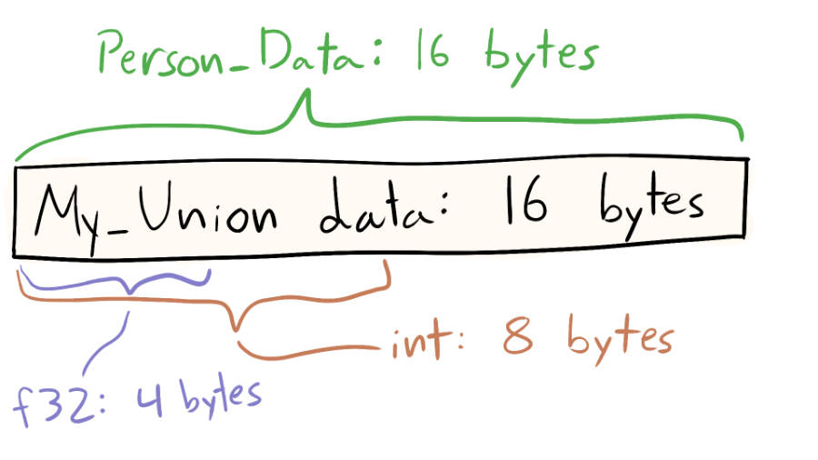

### 5.1 Structs


### 5.2 Enums and switch


### 5.3 Unions
```odin
Person :: struct {
	age:    int,
	health: int,
}

My_Union :: union {
	f32,
	int,
	Person,
}
```

> The My_Union type will only use as much memory as the biggest variant. It can only contain one of the variants at a time, so it can use the same block of memory for all of them. You can think of it as three different variables that all share the same memory, but you're only allowed to use one of them at a time.

